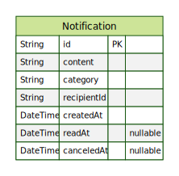

# Notification Services

## Features

# Run locally

```bash
# clone this repository
git clone

# install all dependencies
npm i

# copy .env.example
cp .env.example .env

# run locally

npm run start:dev
```

## Migrations


